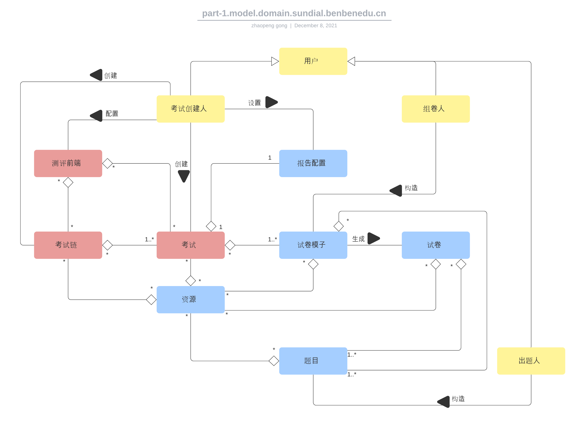
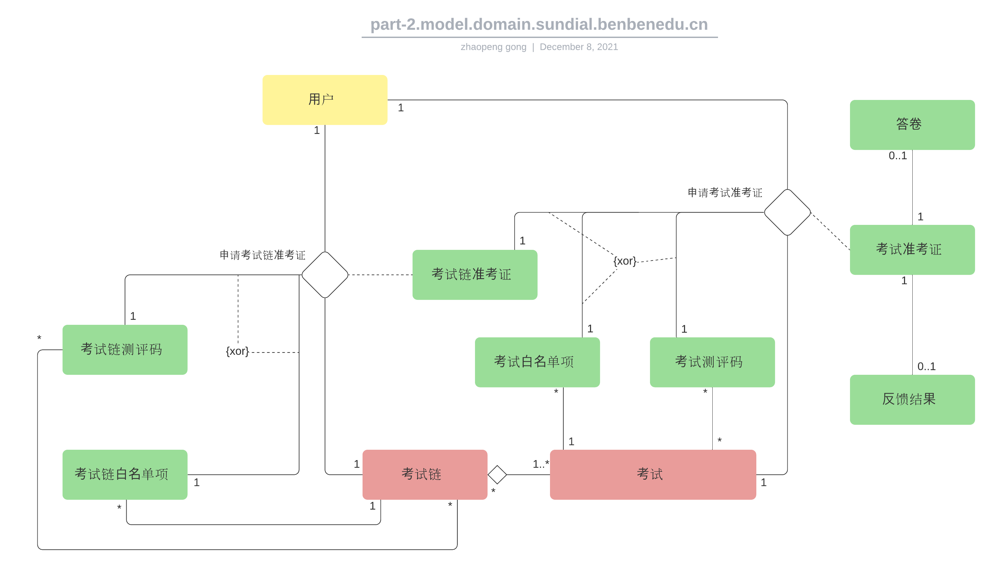

> # Sundial测评中台架构及设计

> ## *1. 业务逻辑*

Sundial测评中台支撑测评相关的三类业务活动

- [X] 内容创作  
  `包括出题(对应的题库维护)，组卷`
- [X] 测评创建及实施  
  `包括创建和发布考试/考试链，配置测评前端，生成参测凭证，完成考试&提交数据`
- [X] 反馈及报告  
  `反馈个人报告数据，呈现可阅览的报告形式`

> ### *1.1 核心业务活动*

- **出题**

      题目是测评内容创作的核心元件，是题库管理的基本单位，同时也是试卷的基本构成单位。
      题目区分单选、多选、填空、复合题等各种题型。
      出题过程由专业的题目构建人员执行和维护。

- **组卷**

      试卷是考试的内容单位和必要组件。
      组卷过程由专业的试卷构建人员执行和维护。确定试卷的模块组织结构，从题库中为试卷的相应模块选定题目集，
      在模块层级上设置必要的约束及策略，设定标题、引导语，添加控制及呈现属性等。
      组卷过程的输出是试卷模子(可视为试卷生成器)，试卷模子区分为静态和动态两种形式。
      静态试卷模子对应一份唯一确定的试卷；动态试卷模子在考试进行时，会根据设定的策略对应不同的参测人次生成不同的试卷。

- **创建考试/考试链**

      考试是测评实施的基本构建单位，个人报告的生成面向考试。
      创建考试，核心是确定考试对应的试卷模子池，考试开始时，不同的参考人次会被分配试卷模子进而匹配对应的试卷。
      在创建考试时，可视需要设置考试开始时间、持续时长等控制属性。
      考试链由多个业务上关联的线性有序考试序列构成，不同的参考人次在加入考试链时会被分配对应的考试序列。
      创建考试链，核心是确定所包含的各个考试序列。

- **考试对应的报告配置**

      配置考试对应报告的类型、生成方式及其它业务参数。

- **发布考试/考试链**

      在测评正式开始前，相关的考试/考试链须确认发布，参测人员方可正式加入。
      发布过程中，还会将涉及的相关资源(如图片、音频、视频等)推送到开放的资源服务器上，使其外部可见。

- **配置测评前端**

      不同的测评类型和场景，对应的Web测评前端会有所区别。
      配置测评前端的过程，关键是指定测评类型，配置对应的考试/考试链，设置测评的用户登录方式、准入方式等。
      通过设置对应的属性，可对测评前端的呈现进行一定程度的定制。
      测评前端配置完成后，会确定对应Web访问链接。

- **生成参测凭证**

      考试/考试链若为公开型，则不做准入限制；若为封闭型，则有准考证和白名单两种准入控制机制。
      生成参测凭证，一般在测评层面上操作。
      若测评采用测评码准入机制，则按需生成对应数量的测评码，每个测评码可适用于该测评对应的任意一个考试/考试链(但最终只能加入一个)。
      若测评采用白名单准入机制，则将目标参测用户添加到对应的考试/考试链的白名单上。

- **完成考试&提交数据**

      参测用户通过Web链接访问测评前端，登录，经由对应的准入机制进入测评过程，完成考试，提交作答数据。

- **呈现个人报告**

      参测用户的作答数据确认完成提交后，会被处理并输出相应的个人报告数据，生成可读的报告形式(如PDF，H5)。
      个人报告会以测评定义的方式反馈给参测用户。

> ### *1.2 其它重要的业务活动*

- **用户注册&管理**

      参测用户、内容创作者、考试创建者等等各种形式的平台用户均需通过自身的平台账户登录、访问平台。
      用户可通过手机号码等形式自行注册账户，也可由相关的管理人员在平台上直接创建账户。
      如在2B测评业务场景中，可为参测学生批量创建账户，预置相关的学生信息。

- **资源管理**

      出题、组卷等等业务活动中，会频繁涉及图片、音频、视频等资源的使用。
      资源被引用前，需上传到平台。
      随着资源库的扩充，需要有效的方式进行查找、组织、管理等。

> ### *1.3 领域模型*

> ## *2. 实现*

> ## *3. 进程视图*

> ## *4. 部署视图*