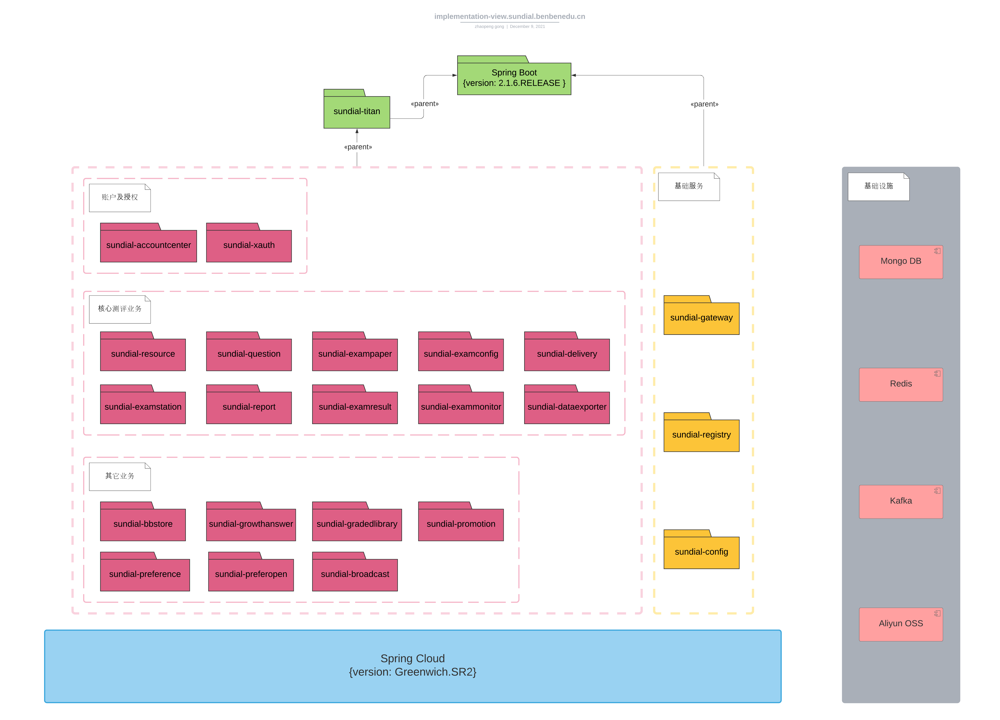

> # Sundial测评中台架构及设计

> ## *1. 业务逻辑*

Sundial测评中台支撑测评相关的三类业务活动

- [X] 内容创作  
  `包括出题(对应的题库维护)，组卷`
- [X] 测评创建及实施  
  `包括创建和发布考试/考试链，配置测评前端，生成参测凭证，完成考试&提交数据`
- [X] 反馈及报告  
  `反馈个人报告数据，呈现可阅览的报告形式`

> ### *1.1 核心业务活动*

- **出题**

      题目是测评内容创作的核心元件，是题库管理的基本单位，同时也是试卷的基本构成单位。
      题目区分单选、多选、填空、复合题等各种题型。
      出题过程由专业的题目构建人员执行和维护。

- **组卷**

      试卷是考试的内容单位和必要组件。
      组卷过程由专业的试卷构建人员执行和维护。确定试卷的模块组织结构，从题库中为试卷的相应模块选定题目集，
      在模块层级上设置必要的约束及策略，设定标题、引导语，添加控制及呈现属性等。
      组卷过程的输出是试卷模子(可视为试卷生成器)，试卷模子区分为静态和动态两种形式。
      静态试卷模子对应一份唯一确定的试卷；动态试卷模子在考试进行时，会根据设定的策略对应不同的参测人次生成不同的试卷。

- **创建考试/考试链**

      考试是测评实施的基本构建单位，个人报告的生成面向考试。
      创建考试，核心是确定考试对应的试卷模子池，考试开始时，不同的参考人次会被分配试卷模子进而匹配对应的试卷。
      在创建考试时，可视需要设置考试开始时间、持续时长等控制属性。
      考试链由多个业务上关联的线性有序考试序列构成，不同的参考人次在加入考试链时会被分配对应的考试序列。
      创建考试链，核心是确定所包含的各个考试序列。

- **考试对应的报告配置**

      配置考试对应报告的类型、生成方式及其它业务参数。

- **发布考试/考试链**

      在测评正式开始前，相关的考试/考试链须确认发布，参测人员方可正式加入。
      发布过程中，还会将涉及的相关资源(如图片、音频、视频等)推送到开放的资源服务器上，使其外部可见。

- **配置测评前端**

      不同的测评类型和场景，对应的Web测评前端会有所区别。
      配置测评前端的过程，关键是指定测评类型，配置对应的考试/考试链，设置测评的用户登录方式、准入方式等。
      通过设置对应的属性，可对测评前端的呈现进行一定程度的定制。
      测评前端配置完成后，会确定对应Web访问链接。

- **生成参测凭证**

      考试/考试链若为公开型，则不做准入限制；若为封闭型，则有准考证和白名单两种准入控制机制。
      生成参测凭证，一般在测评层面上操作。
      若测评采用测评码准入机制，则按需生成对应数量的测评码，每个测评码可适用于该测评对应的任意一个考试/考试链(但最终只能加入一个)。
      若测评采用白名单准入机制，则将目标参测用户添加到对应的考试/考试链的白名单上。

- **完成考试&提交数据**

      参测用户通过Web链接访问测评前端，登录，经由对应的准入机制进入测评过程，完成考试，提交作答数据。

- **呈现个人报告**

      参测用户的作答数据确认完成提交后，会被处理并输出相应的个人报告数据，生成可读的报告形式(如PDF，H5)。
      个人报告会以测评定义的方式反馈给参测用户。

> ### *1.2 其它重要的业务活动*

- **用户注册&管理**

      参测用户、内容创作者、考试创建者等等各种形式的平台用户均需通过自身的平台账户登录、访问平台。
      用户可通过手机号码等形式自行注册账户，也可由相关的管理人员在平台上直接创建账户。
      如在2B测评业务场景中，可为参测学生批量创建账户，预置相关的学生信息。

- **资源管理**

      出题、组卷等等业务活动中，会频繁涉及图片、音频、视频等资源的使用。
      资源被引用前，需上传到平台。
      随着资源库的扩充，需要有效的方式进行查找、组织、管理等。

> ### *1.3 领域模型*

下图描述了内容创作及测评创建活动对应的领域对象、参与角色以及相互之间的关系。

下图描述了测评实施及结果反馈活动对应的领域对象及相互间的关系。

> ## *2. 实现*

Sundial测评中台采用微服务模式，基于Spring Cloud及Spring Boot框架提供的能力进行开发。  
选用Mongo DB作为主要的数据库组件，Redis作为缓存组件，Kafka作为消息中间件，Aliyun OSS作为公开的资源存储服务。  
各个微服务项目、开发框架及基础设施组件的结构如下图所示。

以下按分类对每个微服务项目做简要说明。

> ### *2.1 基础服务*

- ***sundial-config | 配置中心***  
  为所有其它微服务提供统一的、集中化的配置服务。

- ***sundial-registry | 注册中心***  
  提供微服务注册、查找等基础服务能力。

- ***sundial-gateway | 网关***  
  Sundial测评中台对外的统一的访问入口。

> ### *2.2 账户及授权*

- ***sundial-accountcenter | 账户中心***  
  管理账户及相关信息，如账户注册，账户创建、修改等等。

- ***sundial-xauth | 授权中心***  
  认证、授权及权限控制等。

> ### *2.3 核心测评业务*

- ***sundial-resource***  
  上传、管理资源，如图片、音频、视频等。

- ***sundial-question***  
  创建题目，题库管理。

- ***sundial-exampaper***  
  创建、管理试卷模子。

- ***sundial-examconfig***  
  创建、管理考试/考试链。  

- ***sundial-delivery***  
  将题目、试卷模子、考试/考试链等业务对象引用的资源递送至公开的资源服务(Aliyun OSS)，使其外部可见。  
  维护、管理相关的递送任务。  
  实现资源、题目、试卷模子等内容对象在不同部署环境间的同步。  

- ***sundial-examstation | 考试站***  
  载入考试/考试链及相关的试卷模子等。  
  创建、管理测评实施相关的测评码、白名单等参测凭证。  
  控制准考证的申请、相关参测凭证的核销，分发试卷，接收答卷的提交。  
  是驱动测评过程实际执行的核心服务。   

- ***sundial-report***  
  监听答卷提交确认事件，对答卷数据进行预处理。  
  向报告中心发出报告处理请求。  
  接收报告中心回传的报告处理结果，将结果推送到***examresult***微服务。  

- ***sundial-examresult***  
  提供测评结果报告的访问服务。  

- ***sundial-exammonitor***  
  提供测评过程相关的监控服务。  

- ***sundial-dataexporter***  
  提供答卷等数据的导出服务。  

> ### *2.4 其它业务*  

- ***sundial-bbstore | 本本小店***  
  提供基本的商品售卖、支付等服务。  

- ***sundial-growthanswer***  
  `成长答案`App对应的业务后端微服务。  

- ***sundial-gradedlibrary***  
  `本本书巢`小程序对应的业务后端微服务。  

- ***sundial-promotion***  
  配合运营推广活动的需要，提供诸如场景相关的短信发送，微信小程序/微信小店客服消息下发、自动回复等服务。  

- ***sundial-preference***  
  `VIP志愿`小程序对应的业务后端微服务。

- ***sundial-preferopen***  
  高考志愿相关业务对应的开放接口服务，实现核心的业务逻辑及算法，供小猿、本本`VIP志愿`小程序调用。  

- ***sundial-broadcast***  
  满足特殊的第三方（主要为宜信）对接需求，如定制化的加密、认证、报告结果通知/查询等。  

> ## *3. 进程视图*

> ## *4. 部署视图*